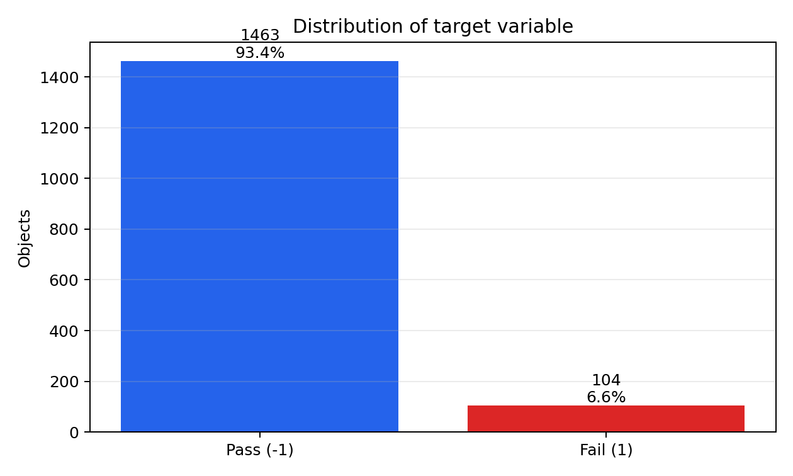
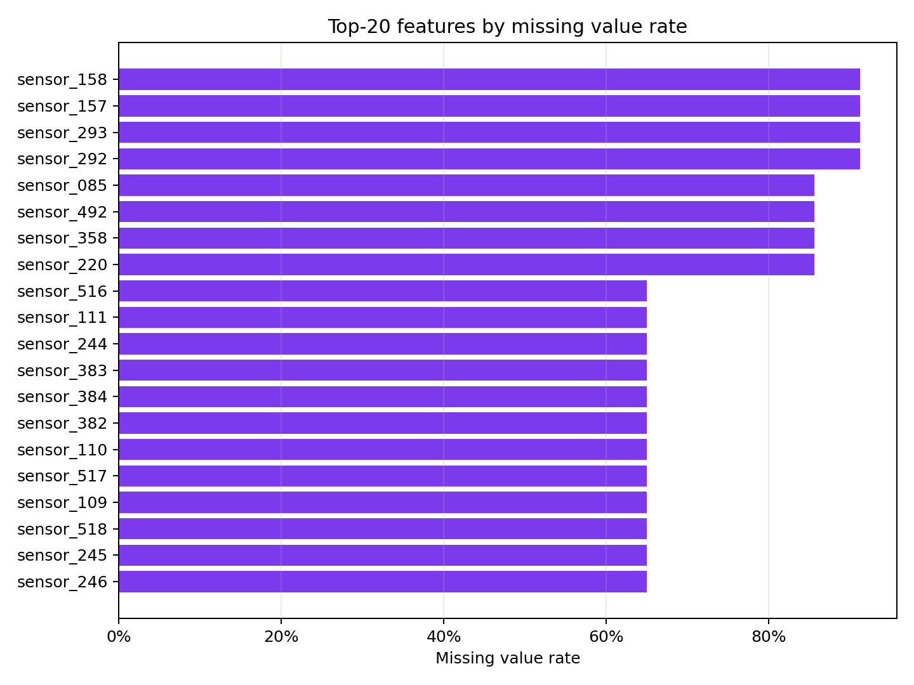
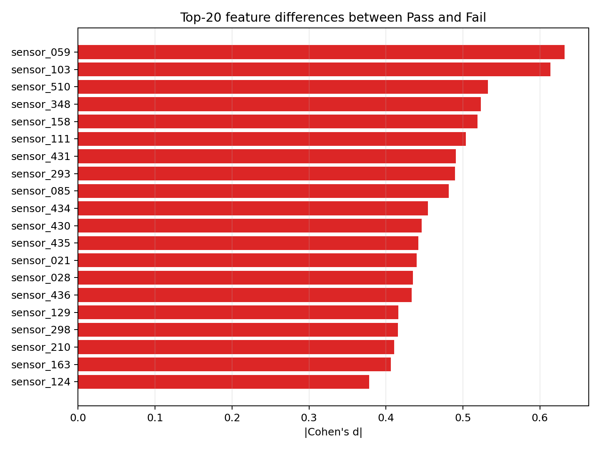
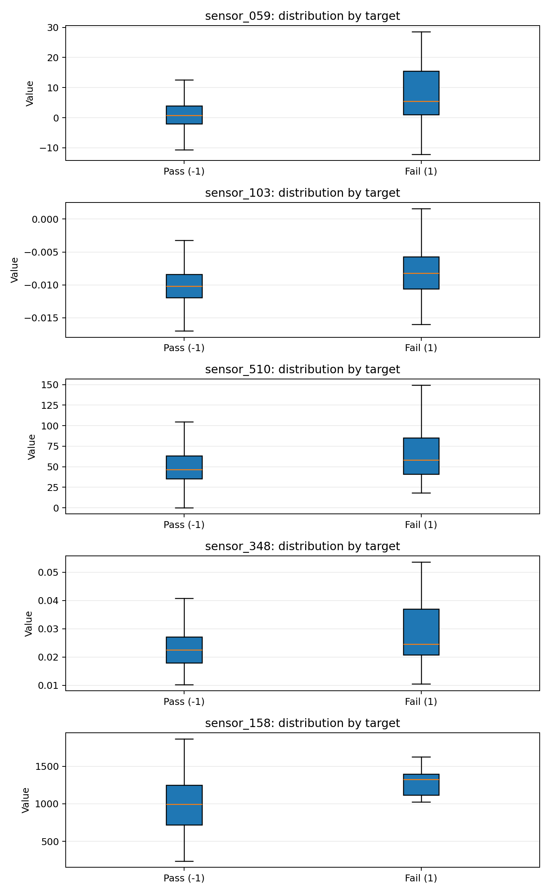
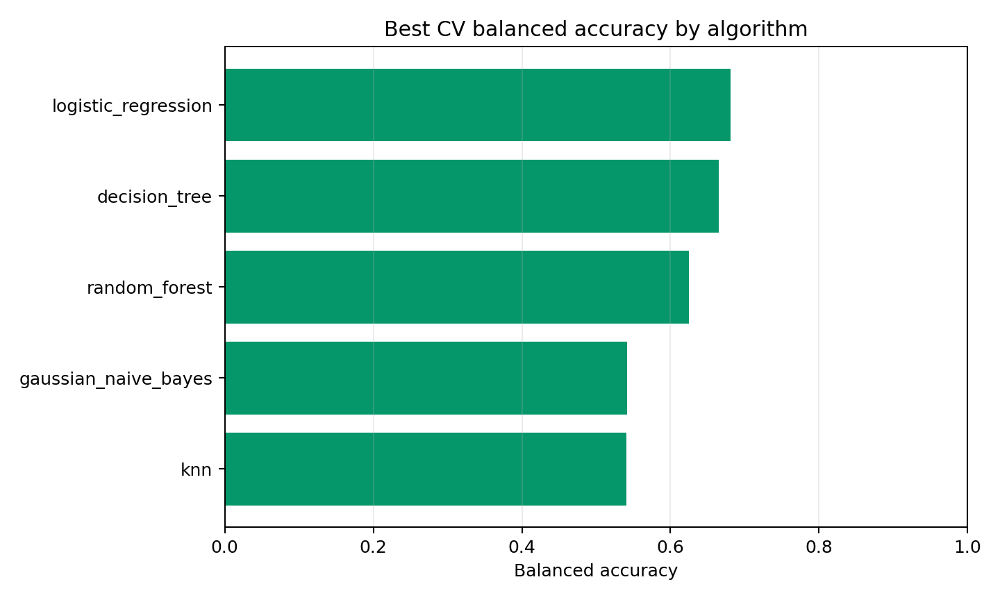

# SECOM: анализ, подготовка данных и построение модели

## 1. Анализ предметной области

### Априорные знания и ограничения

SECOM описывает процесс производства полупроводников: каждая запись соответствует одной производственной единице, а признаки являются измерениями сенсоров или контрольных точек процесса. Краткое описание исходного набора: A complex modern semi-conductor manufacturing process is normally under consistent surveillance via the monitoring of signals/variables collected from sensors and or process measurement points. However, not all of these signals are equally valuable in a specific monitoring system. The measured signals contain a combination of useful information, irrelevant information as well as noise. It is often the case that useful information is buried in the latter two. Engineers typically have a much larger number of signals than are actually required. If we consider each type of signal as a feature, then feature selection may be applied to identify the most relevant signals. The Process Engineers may then use these signals to determine key factors contributing to yield excursions downstream in the process. This will enable an increase in process throughput, decreased time to learning and reduce the per unit production costs. To enhance current business improvement techniques the application of feature selection as an intelligent systems technique is being investigated. The dataset presented in this case represents a selection of such features where each example represents a single production entity with associated measured features and the labels represent a simple pass/fail yield for in house line testing, figure 2, and associated date time stamp. Where .1 corresponds to a pass and 1 corresponds to a fail and the data time stamp is for that specific test point.

Априорные знания:

- целевая метка бинарная: `-1` означает Pass, `1` означает Fail;
- Fail является редким, но критичным событием: 104 из 1567 объектов (6.64%);
- признаки анонимизированы, поэтому модель выявляет статистические зависимости, а не автоматически доказанные физические причины брака;
- сенсорные признаки имеют разные масштабы и требуют нормализации;
- пропуски являются частью реальных технологических данных и должны обрабатываться внутри обучающего pipeline.

Ограничения:

- малый размер выборки при большой размерности: 1567 объектов и 590 исходных признаков;
- сильный дисбаланс классов;
- возможные шум, корреляции и технологический дрейф;
- без расшифровки сенсоров интерпретация требует участия инженеров-технологов.

### Цель анализа, критерии качества и процедура проверки

Цель - построить модель раннего выявления риска `Fail` и выделить признаки, наиболее связанные со снижением выхода годных изделий.

Основной критерий качества - Balanced Accuracy, эквивалентно минимизации Balanced Error Rate: `BER = 1 - Balanced Accuracy`. Дополнительные критерии: Recall Fail, F1 Fail, ROC AUC. Обычная accuracy не выбрана основной, потому что при доле Fail 6.6% тривиальная модель почти всегда предсказывает Pass.

Процедура проверки:

- стратифицированное разделение на train/hold-out 80/20;
- на train-части - стратифицированная 5-fold cross-validation;
- медианная импутация, удаление признаков с большой долей пропусков, стандартизация и отбор признаков пересчитываются внутри каждого fold;
- лучшая гипотеза выбирается по `mean_test_balanced_accuracy`;
- после выбора модели threshold дополнительно настраивается на train через cross-validation;
- итоговая оценка выполняется один раз на hold-out.

### Пользовательские сценарии

1. Инженер-технолог загружает новые сенсорные измерения, система применяет сохраненный pipeline и выдает вероятность `Fail`.
2. Аналитик качества запускает переобучение и получает отчет с BER, Recall Fail и списком важных сенсоров.
3. Оператор мониторинга сортирует производственные единицы по риску `Fail` и отправляет верхнюю группу на дополнительную проверку.
4. Инженер процесса изучает top-признаки и суррогатное дерево для поиска технологических факторов.
5. Ответственный за ML-мониторинг отслеживает долю пропусков, распределения z-score и падение качества на новых данных.

## 2. Формирование и подготовка данных

### Сырые данные

В анализ включены все 1567 строк из `secom.data` и соответствующие метки из `secom_labels.data`. Используются все исходные 590 сенсорных признаков, потому что признаки анонимизированы и заранее исключать технологические точки без предметной расшифровки рискованно. Временная метка сохранена для контроля периода наблюдений: 2008-07-19 11:55:00 - 2008-10-17 06:07:00, но не используется как входной признак модели.

### Предобработка

- Проверка консистентности: число строк признаков совпадает с числом меток; дубликатов строк: 0.
- Пропуски: признаки с долей пропусков выше 50% удаляются внутри обучающего fold, остальные значения заполняются медианой.
- Артефакты: константные признаки удаляются через `VarianceThreshold`.
- Нормализация: применяется `StandardScaler`, так как признаки имеют разные масштабы.
- Дискретизация: не используется как обязательный шаг, чтобы не терять информацию; пороговые правила строятся отдельно суррогатным деревом.

Сводка пропусков: всего пропущенных значений 41951 (4.54%), признаки с пропусками: 538, строки с пропусками: 1567. Константных признаков: 116.

### Feature engineering

В pipeline реализованы:

- `missing_count` и `missing_rate` для каждой строки;
- `mean_abs_z` и `max_abs_z` как интегральные показатели отклонения объекта от типичного технологического состояния;
- фильтрация по доле пропусков;
- supervised feature selection через `SelectKBest(f_classif)`;
- перебор `select__k` как гиперпараметра.

PCA можно использовать как дополнительную визуализацию, но в целевой модели выбран отбор top-K признаков, потому что он лучше сохраняет интерпретируемость анонимизированных сенсоров.

### Разведочный анализ данных

Top-5 признаков по абсолютному Cohen's d:

| Признак | Доля пропусков | Mean Pass | Mean Fail | Cohen's d |
|---|---:|---:|---:|---:|
| sensor_059 | 0.45% | 2.5635 | 8.5151 | 0.6319 |
| sensor_103 | 0.13% | -0.0099 | -0.0081 | 0.6137 |
| sensor_510 | 0.13% | 54.4406 | 74.3479 | 0.5326 |
| sensor_348 | 1.53% | 0.0243 | 0.0304 | 0.5233 |
| sensor_158 | 91.19% | 1027.4569 | 1237.7999 | 0.5189 |

Графики:









## 3. Построение модели и валидация

### Тип задачи

Это задача бинарной классификации с сильным дисбалансом классов. Модель оценивает вероятность класса `Fail`; дополнительно решается задача отбора значимых признаков для диагностики процесса.

### Гипотезы

| Гипотеза | Диапазон гиперпараметров | Обоснование |
|---|---|---|
| Logistic Regression | `select__k`: 20..120; `C`: 0.01..10; `penalty`: L1/L2 | Интерпретируемая линейная baseline-модель для большой размерности после стандартизации. |
| Gaussian Naive Bayes | `select__k`: 10..80; `var_smoothing`: 1e-9..1e-3 | Быстрая вероятностная модель, часто устойчивая на малых выборках после отбора признаков. |
| KNN | `select__k`: 10..40; `n_neighbors`: 3..25; `weights`: uniform/distance | Нелинейная гипотеза локального сходства объектов после нормализации. |
| Decision Tree | `select__k`: 10..80; `max_depth`: 2..5; `min_samples_leaf`: 10..40 | Пороговые правила удобны для диагностической интерпретации технологических состояний. |
| Random Forest | `select__k`: 40..80; `max_depth`: 3/5/None; `min_samples_leaf`: 5/20 | Ансамбль деревьев проверяет устойчивые нелинейные зависимости и взаимодействия признаков. |

### Результаты перебора

Лучшие модели по алгоритмам:

| Алгоритм | CV Balanced Accuracy | CV BER | CV Recall Fail | CV F1 Fail | Параметры |
|---|---:|---:|---:|---:|---|
| logistic_regression | 0.6809 | 0.3191 | 0.6147 | 0.2362 | `{"model__C": 0.1, "model__penalty": "l1", "select__k": 20}` |
| decision_tree | 0.6647 | 0.3353 | 0.6397 | 0.2287 | `{"model__max_depth": 4, "model__min_samples_leaf": 40, "select__k": 20}` |
| random_forest | 0.6249 | 0.3751 | 0.3360 | 0.2637 | `{"model__max_depth": 3, "model__max_features": "sqrt", "model__min_samples_leaf": 20, "select__k": 80}` |
| gaussian_naive_bayes | 0.5413 | 0.4587 | 0.1331 | 0.1434 | `{"model__var_smoothing": 1e-09, "select__k": 40}` |
| knn | 0.5405 | 0.4595 | 0.0963 | 0.1458 | `{"model__n_neighbors": 3, "model__weights": "distance", "select__k": 10}` |

Выбранная модель: **logistic_regression**.

Лучшие параметры: `{"model__C": 0.1, "model__penalty": "l1", "select__k": 20}`.

Подобранный threshold для класса Fail: `0.49`.

Hold-out метрики:

| Метрика | Значение |
|---|---:|
| Accuracy | 0.6752 |
| Balanced Accuracy | 0.6712 |
| BER | 0.3288 |
| Recall Fail | 0.6667 |
| Recall Pass | 0.6758 |
| Precision Fail | 0.1284 |
| F1 Fail | 0.2154 |
| ROC AUC | 0.6886 |
| TP / FN / FP / TN | 14 / 7 / 95 / 198 |



## 4. Интерпретация и объяснение модели

Построена глобальная суррогатная модель - дерево решений глубины 3, обученное воспроизводить прогнозы выбранной модели на подготовленных признаках. Fidelity суррогата: 0.8140.

Правила сохранены в `surrogate_rules.txt`, изображение дерева - `surrogate_tree.png`.

Первые выбранные признаки итогового pipeline:

sensor_021, sensor_026, sensor_059, sensor_103, sensor_122, sensor_160, sensor_163, sensor_164, sensor_165, sensor_295, sensor_298, sensor_299, sensor_300, sensor_348, sensor_430, sensor_431, sensor_434, sensor_435, sensor_436, sensor_510

Фрагмент правил:

```text
|--- sensor_059 <= 0.363
|   |--- sensor_103 <= 0.073
|   |   |--- sensor_021 <= 0.580
|   |   |   |--- class: 0
|   |   |--- sensor_021 >  0.580
|   |   |   |--- class: 1
|   |--- sensor_103 >  0.073
|   |   |--- sensor_021 <= 0.004
|   |   |   |--- class: 0
|   |   |--- sensor_021 >  0.004
|   |   |   |--- class: 1
|--- sensor_059 >  0.363
|   |--- sensor_103 <= 0.040
|   |   |--- class: 1
|   |--- sensor_103 >  0.040
|   |   |--- sensor_021 <= -0.882
|   |   |   |--- class: 1
|   |   |--- sensor_021 >  -0.882
```

## Вывод

SECOM следует решать как дисбалансную бинарную классификацию с фокусом на BER/Balanced Accuracy и Recall Fail. Для практического применения важно сохранять весь pipeline предобработки, регулярно проверять дрейф распределений и рассматривать найденные top-признаки как кандидаты для технологического расследования.
